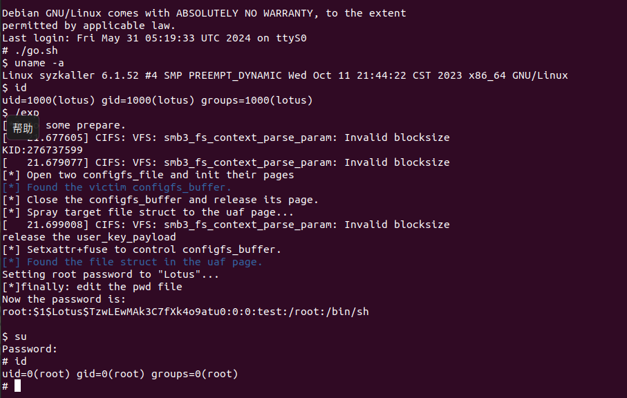

Use FUSE and configfs_buffer as victim object.

To initialize the USB files required by configfs_buffer, please run the go.sh script beforehand with root privileges.

I use configfs_buffer to construct Page-UAF and edit the normal file->f_mapping to the pwd_file->f_mapping.

